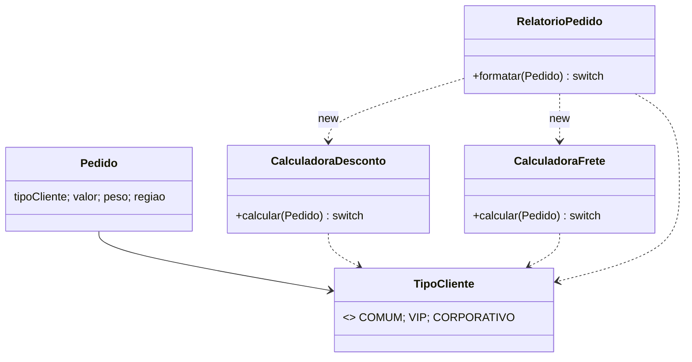
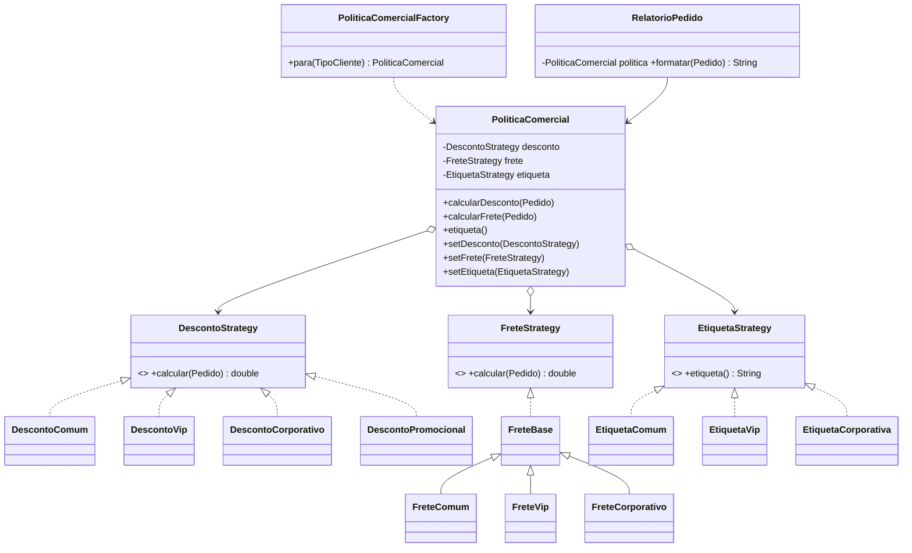

# Exercício 2: Rastreando o anti-pattern em um projeto real (Strategy)

Projeto analisado: `projeto_strategy_antipattern` (Maven, Java 17), pacote `br.venson.net.designpatterns.strategy`.

---

## 1. Decisões de comportamento baseadas em `TipoCliente`

O mesmo `switch (pedido.getTipoCliente())` aparece em **3 classes**:

| Classe | O que decide pelo tipo |
|---|---|
| `CalculadoraDesconto` | percentual de desconto (0%, 10%, 20%) |
| `CalculadoraFrete` | frete base (R$ 25, R$ 12, R$ 0) |
| `RelatorioPedido` | etiqueta exibida no texto do relatório |

**O que isso indica sobre o design:**

- **Switch repetido (shotgun surgery):** a variação por tipo de cliente não está encapsulada. Ela se espalha por várias classes.
- **Violação do Open/Closed:** cada variação nova exige modificar código que já funciona.
- **Falta de polimorfismo:** o comportamento deveria pertencer a objetos intercambiáveis, e não a condicionais.
- **Conhecimento duplicado:** a etiqueta do relatório escreve "10%" e "20%" no texto, repetindo o que `CalculadoraDesconto` já define. Se o percentual mudar em um lugar, o relatório passa a mentir.
- **Erro tardio:** o `default` lança `IllegalArgumentException` apenas em runtime. O compilador não avisa quando um `case` é esquecido.

---

## 2. Adicionar um novo tipo de cliente (`PARCEIRO`)

Seriam alterados **4 arquivos**:

1. `TipoCliente.java`: nova constante `PARCEIRO`.
2. `CalculadoraDesconto.java`: novo `case`.
3. `CalculadoraFrete.java`: novo `case`.
4. `RelatorioPedido.java`: novo `case`.

`Main.java` só muda se quisermos demonstrar o novo tipo.

Se um dos três `switch` for esquecido, nada falha na compilação. O erro só aparece quando alguém usar `PARCEIRO`.

---

## 3. Por que é difícil testar por regra

- **Dependências criadas com `new` dentro do método:** `RelatorioPedido` instancia `CalculadoraDesconto` e `CalculadoraFrete` internamente. Não dá para injetar um dublê (mock/stub), então testar a formatação sempre executa as regras reais de desconto e frete.
- **`CalculadoraFrete` mistura três regras em um método:** frete base por tipo, valor por peso e adicional por região. Para validar só o frete base do VIP é preciso montar peso e região e descontar o resto na conta.
- **O `switch` concentra todas as variações em um único método:** cobrir a classe exige um caso por ramo, incluindo o `default`. Com mais tipos e mais regras, o número de casos cresce (tipos × regras) e os testes não se isolam.
- **Formatação acoplada ao cálculo:** testar a etiqueta do relatório obriga a passar pelo cálculo de desconto e frete.
- `CalculadoraDesconto` é a mais simples de testar, mas ainda carrega o `switch` completo apenas para verificar o ramo VIP.

---

## 4. Refatoração com o padrão Strategy

### 4.1 Estrutura do projeto

```
src/main/java/br/venson/net/designpatterns/strategy/
├── Main.java                       (alterado)
├── Pedido.java                     (igual)
├── TipoCliente.java                (igual)
├── RelatorioPedido.java            (alterado: sem switch)
├── desconto/
│   ├── DescontoStrategy.java       (interface)
│   ├── DescontoComum.java
│   ├── DescontoVip.java
│   ├── DescontoCorporativo.java
│   └── DescontoPromocional.java    (usada no item 5)
├── frete/
│   ├── FreteStrategy.java          (interface)
│   ├── FreteBase.java              (parte comum: peso + região)
│   ├── FreteComum.java
│   ├── FreteVip.java
│   └── FreteCorporativo.java
├── etiqueta/
│   ├── EtiquetaStrategy.java       (interface)
│   ├── EtiquetaComum.java
│   ├── EtiquetaVip.java
│   └── EtiquetaCorporativa.java
└── contexto/
    ├── PoliticaComercial.java      (contexto que delega)
    └── PoliticaComercialFactory.java
```

`CalculadoraDesconto.java` e `CalculadoraFrete.java` são removidos, pois as regras passam a viver nas estratégias.

### 4.2 Diagrama de classes: antes



### 4.3 Diagrama de classes: depois



### 4.4 Interfaces de estratégia

```java
// desconto/DescontoStrategy.java
package br.venson.net.designpatterns.strategy.desconto;

import br.venson.net.designpatterns.strategy.Pedido;

public interface DescontoStrategy {
    double calcular(Pedido pedido);
}
```

```java
// frete/FreteStrategy.java
package br.venson.net.designpatterns.strategy.frete;

import br.venson.net.designpatterns.strategy.Pedido;

public interface FreteStrategy {
    double calcular(Pedido pedido);
}
```

```java
// etiqueta/EtiquetaStrategy.java
package br.venson.net.designpatterns.strategy.etiqueta;

@FunctionalInterface
public interface EtiquetaStrategy {
    String etiqueta();
}
```

### 4.5 Estratégias concretas

**Desconto**

```java
// desconto/DescontoComum.java
package br.venson.net.designpatterns.strategy.desconto;

import br.venson.net.designpatterns.strategy.Pedido;

public class DescontoComum implements DescontoStrategy {
    @Override
    public double calcular(Pedido pedido) { return pedido.getValor() * 0.0; }
}
```

```java
// desconto/DescontoVip.java
package br.venson.net.designpatterns.strategy.desconto;

import br.venson.net.designpatterns.strategy.Pedido;

public class DescontoVip implements DescontoStrategy {
    @Override
    public double calcular(Pedido pedido) { return pedido.getValor() * 0.10; }
}
```

```java
// desconto/DescontoCorporativo.java
package br.venson.net.designpatterns.strategy.desconto;

import br.venson.net.designpatterns.strategy.Pedido;

public class DescontoCorporativo implements DescontoStrategy {
    @Override
    public double calcular(Pedido pedido) { return pedido.getValor() * 0.20; }
}
```

```java
// desconto/DescontoPromocional.java
package br.venson.net.designpatterns.strategy.desconto;

import br.venson.net.designpatterns.strategy.Pedido;

public class DescontoPromocional implements DescontoStrategy {
    private final double percentual;

    public DescontoPromocional(double percentual) { this.percentual = percentual; }

    @Override
    public double calcular(Pedido pedido) { return pedido.getValor() * percentual; }
}
```

**Frete**

Só o frete base depende do tipo de cliente. Peso e região são comuns, então ficam em uma classe base (Template Method), e o resultado é idêntico ao do código original.

```java
// frete/FreteBase.java
package br.venson.net.designpatterns.strategy.frete;

import br.venson.net.designpatterns.strategy.Pedido;

public abstract class FreteBase implements FreteStrategy {
    private static final double VALOR_POR_KG = 3.0;
    private static final double ADICIONAL_NORTE = 30.0;

    protected abstract double freteBase();

    @Override
    public final double calcular(Pedido pedido) {
        double fretePorPeso = pedido.getPeso() * VALOR_POR_KG;
        double adicionalRegiao =
                pedido.getRegiao().equalsIgnoreCase("norte") ? ADICIONAL_NORTE : 0.0;
        return freteBase() + fretePorPeso + adicionalRegiao;
    }
}
```

```java
// frete/FreteComum.java
package br.venson.net.designpatterns.strategy.frete;

public class FreteComum extends FreteBase {
    @Override protected double freteBase() { return 25.0; }
}
```

```java
// frete/FreteVip.java
package br.venson.net.designpatterns.strategy.frete;

public class FreteVip extends FreteBase {
    @Override protected double freteBase() { return 12.0; }
}
```

```java
// frete/FreteCorporativo.java
package br.venson.net.designpatterns.strategy.frete;

public class FreteCorporativo extends FreteBase {
    @Override protected double freteBase() { return 0.0; }
}
```

**Etiqueta (formatação)**

```java
// etiqueta/EtiquetaComum.java
package br.venson.net.designpatterns.strategy.etiqueta;

public class EtiquetaComum implements EtiquetaStrategy {
    @Override public String etiqueta() { return "Cliente comum"; }
}
```

```java
// etiqueta/EtiquetaVip.java
package br.venson.net.designpatterns.strategy.etiqueta;

public class EtiquetaVip implements EtiquetaStrategy {
    @Override public String etiqueta() { return "Cliente VIP (10% de desconto)"; }
}
```

```java
// etiqueta/EtiquetaCorporativa.java
package br.venson.net.designpatterns.strategy.etiqueta;

public class EtiquetaCorporativa implements EtiquetaStrategy {
    @Override public String etiqueta() { return "Cliente corporativo (20% de desconto)"; }
}
```

### 4.6 Contexto que delega

```java
// contexto/PoliticaComercial.java
package br.venson.net.designpatterns.strategy.contexto;

import br.venson.net.designpatterns.strategy.Pedido;
import br.venson.net.designpatterns.strategy.desconto.DescontoStrategy;
import br.venson.net.designpatterns.strategy.etiqueta.EtiquetaStrategy;
import br.venson.net.designpatterns.strategy.frete.FreteStrategy;

public class PoliticaComercial {
    private DescontoStrategy desconto;
    private FreteStrategy frete;
    private EtiquetaStrategy etiqueta;

    public PoliticaComercial(DescontoStrategy desconto, FreteStrategy frete,
                             EtiquetaStrategy etiqueta) {
        this.desconto = desconto;
        this.frete = frete;
        this.etiqueta = etiqueta;
    }

    public double calcularDesconto(Pedido pedido) { return desconto.calcular(pedido); }
    public double calcularFrete(Pedido pedido)    { return frete.calcular(pedido); }
    public String etiqueta()                      { return etiqueta.etiqueta(); }

    public void setDesconto(DescontoStrategy desconto) { this.desconto = desconto; }
    public void setFrete(FreteStrategy frete)          { this.frete = frete; }
    public void setEtiqueta(EtiquetaStrategy etiqueta) { this.etiqueta = etiqueta; }
}
```

### 4.7 Montagem por tipo de cliente (único lugar que conhece `TipoCliente`)

```java
// contexto/PoliticaComercialFactory.java
package br.venson.net.designpatterns.strategy.contexto;

import java.util.EnumMap;
import java.util.Map;
import java.util.function.Supplier;

import br.venson.net.designpatterns.strategy.TipoCliente;
import br.venson.net.designpatterns.strategy.desconto.*;
import br.venson.net.designpatterns.strategy.etiqueta.*;
import br.venson.net.designpatterns.strategy.frete.*;

public final class PoliticaComercialFactory {

    private static final Map<TipoCliente, Supplier<PoliticaComercial>> REGISTRO =
            new EnumMap<>(TipoCliente.class);

    static {
        REGISTRO.put(TipoCliente.COMUM, () -> new PoliticaComercial(
                new DescontoComum(), new FreteComum(), new EtiquetaComum()));
        REGISTRO.put(TipoCliente.VIP, () -> new PoliticaComercial(
                new DescontoVip(), new FreteVip(), new EtiquetaVip()));
        REGISTRO.put(TipoCliente.CORPORATIVO, () -> new PoliticaComercial(
                new DescontoCorporativo(), new FreteCorporativo(), new EtiquetaCorporativa()));
    }

    private PoliticaComercialFactory() { }

    public static PoliticaComercial para(TipoCliente tipo) {
        Supplier<PoliticaComercial> fornecedor = REGISTRO.get(tipo);
        if (fornecedor == null) {
            throw new IllegalArgumentException("Tipo de cliente sem política: " + tipo);
        }
        return fornecedor.get(); // instância nova a cada chamada
    }
}
```

### 4.8 `RelatorioPedido` dependendo apenas de abstração

```java
// RelatorioPedido.java
package br.venson.net.designpatterns.strategy;

import br.venson.net.designpatterns.strategy.contexto.PoliticaComercial;

public class RelatorioPedido {

    private final PoliticaComercial politica;

    public RelatorioPedido(PoliticaComercial politica) {
        this.politica = politica;
    }

    public String formatar(Pedido pedido) {
        double valorDesconto = politica.calcularDesconto(pedido);
        double valorFrete = politica.calcularFrete(pedido);
        double total = pedido.getValor() - valorDesconto + valorFrete;

        return String.format(
                "%s | valor: %.2f | desconto: %.2f | frete: %.2f | total: %.2f",
                politica.etiqueta(), pedido.getValor(), valorDesconto, valorFrete, total);
    }
}
```

O `RelatorioPedido` agora:

- não importa `TipoCliente`;
- não possui `switch`;
- não faz `new` de nenhuma regra;
- recebe a política por construtor (injeção de dependência) e conhece apenas o contexto, que por sua vez só conhece as interfaces de estratégia.

### 4.9 Adicionar `PARCEIRO` depois da refatoração

Criar `DescontoParceiro`, `FreteParceiro` e `EtiquetaParceiro`, adicionar a constante `PARCEIRO` no enum e registrar uma linha na factory. Nenhuma classe de regra existente é editada.

---

## 5. Troca de comportamento em runtime

```java
// Main.java
package br.venson.net.designpatterns.strategy;

import java.util.List;

import br.venson.net.designpatterns.strategy.contexto.PoliticaComercial;
import br.venson.net.designpatterns.strategy.contexto.PoliticaComercialFactory;
import br.venson.net.designpatterns.strategy.desconto.DescontoPromocional;
import br.venson.net.designpatterns.strategy.desconto.DescontoVip;
import br.venson.net.designpatterns.strategy.etiqueta.EtiquetaVip;

public class Main {

    public static void main(String[] args) {
        Pedido comum = new Pedido(TipoCliente.COMUM, 200.0, 2.0, "sul");
        Pedido vip = new Pedido(TipoCliente.VIP, 200.0, 2.0, "sul");
        Pedido corporativo = new Pedido(TipoCliente.CORPORATIVO, 200.0, 2.0, "norte");

        // Mesmo resultado de antes, agora via políticas montadas pela factory
        for (Pedido p : List.of(comum, vip, corporativo)) {
            PoliticaComercial politica = PoliticaComercialFactory.para(p.getTipoCliente());
            System.out.println(new RelatorioPedido(politica).formatar(p));
        }

        // Troca em runtime: promoção e volta à regra padrão
        PoliticaComercial politicaVip = PoliticaComercialFactory.para(TipoCliente.VIP);
        RelatorioPedido relatorioVip = new RelatorioPedido(politicaVip);

        System.out.println(relatorioVip.formatar(vip));   // 1) regra padrão

        politicaVip.setDesconto(new DescontoPromocional(0.30));
        politicaVip.setEtiqueta(() -> "Cliente VIP (promoção de 30%)");
        System.out.println(relatorioVip.formatar(vip));   // 2) promoção

        politicaVip.setDesconto(new DescontoVip());
        politicaVip.setEtiqueta(new EtiquetaVip());
        System.out.println(relatorioVip.formatar(vip));   // 3) volta ao padrão
    }
}
```

Valores esperados (`valor = 200`, `peso = 2`):

| Pedido | Desconto | Frete | Total |
|---|---|---|---|
| Comum (sul) | 0,00 | 31,00 | 231,00 |
| VIP (sul) | 20,00 | 18,00 | 198,00 |
| Corporativo (norte) | 40,00 | 36,00 | 196,00 |
| VIP em promoção de 30% | 60,00 | 18,00 | 158,00 |

**Como a troca funciona:** o mesmo objeto `relatorioVip` imprime a regra padrão, depois a promoção e depois a regra padrão novamente. Ele não é recriado nem editado. Só a estratégia guardada no contexto (`PoliticaComercial`) muda, e a chamada seguinte já usa a nova regra, sem recompilar. A etiqueta foi trocada junto com o desconto porque o texto original embute o percentual, e sem isso o relatório exibiria "10%" aplicando 30%.

---

## Justificativas de design

- **Uma interface por regra (desconto, frete, etiqueta):** as regras variam por motivos diferentes. Uma interface única forçaria a trocá-las juntas e impediria, por exemplo, uma promoção que altera só o desconto. Separar segue o Single Responsibility e permite testar e substituir cada regra isoladamente.
- **Estratégias concretas por tipo de cliente:** cada ramo de `switch` virou uma classe pequena, sem condicionais. `DescontoVip` pode ser testado sozinho, e as regras de uma mesma família ficam agrupadas em um pacote.
- **`FreteBase` (Template Method):** peso e região são iguais para todos os tipos. Sem a classe base, trocaríamos um `switch` por três cópias da mesma lógica. O `calcular` é `final` para que nenhuma subclasse altere a conta comum sem querer.
- **`PoliticaComercial` como contexto:** agrupa as três estratégias, delega as chamadas e expõe setters para a troca em runtime. Quem a usa não conhece nenhuma implementação concreta.
- **`PoliticaComercialFactory`:** a decisão por `TipoCliente` continua existindo, mas em um único lugar e de forma declarativa (`EnumMap`), em vez de três `switch` espalhados. Devolve uma instância nova a cada chamada, para que trocar uma regra de um pedido não vaze para os outros.
- **`RelatorioPedido` dependente de abstração:** segue o Dependency Inversion. Pode ser testado com uma política montada com estratégias falsas, sem executar as regras reais.